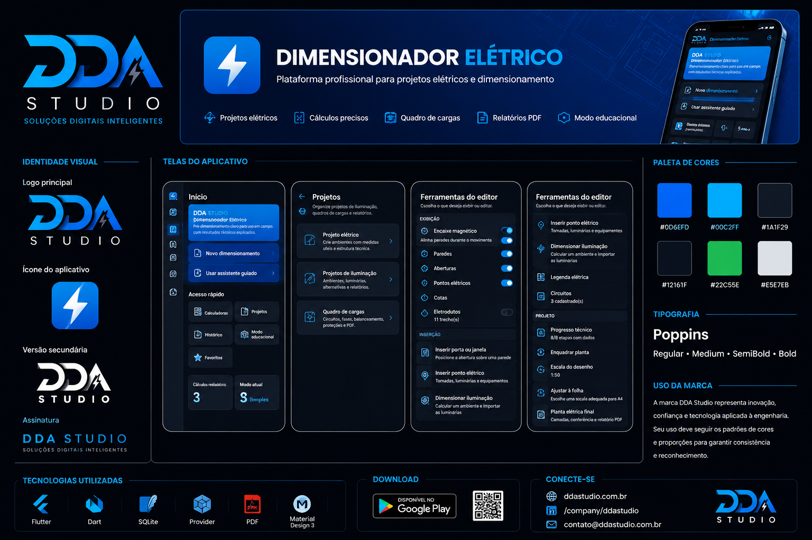

<p align="center">
  
</p>

<h1 align="center">⚡ Dimensionador Elétrico</h1>

<p align="center">
  Plataforma da <strong>DDA Studio</strong> para cálculos, pré-dimensionamento, projetos elétricos e aprendizagem técnica.
</p>

<p align="center">
  
  
  
  
</p>

---

## 📌 Sobre o projeto

O **Dimensionador Elétrico** é uma plataforma desenvolvida pela **DDA Studio** para auxiliar estudantes, técnicos, projetistas, eletricistas e engenheiros.

O aplicativo reúne recursos para:

- pré-dimensionamento de instalações elétricas;
- cálculos e conversões;
- organização de projetos;
- quadros de cargas;
- iluminação;
- motores e transformadores;
- consumo e qualidade de energia;
- aprendizagem e prática de conteúdos elétricos.

A proposta é oferecer ferramentas técnicas em uma interface moderna, organizada e acessível.

---

## 🏠 Tela inicial

A tela inicial oferece acesso rápido aos principais módulos, histórico de cálculos, favoritos, projetos e modo educacional.

<p align="center">
  
</p>

---

## ⚡ Dimensionamento elétrico

O módulo de dimensionamento reúne ferramentas voltadas a instalações, cargas, equipamentos e sistemas de energia.

Entre os recursos disponíveis estão:

- circuitos;
- condutores e disjuntores;
- queda de tensão;
- eletrodutos;
- quadro de cargas;
- iluminação;
- demanda;
- motores;
- transformadores;
- correção do fator de potência;
- energia solar simplificada.

<p align="center">
  
</p>

---

## 🧮 Calculadoras elétricas

O aplicativo possui ferramentas para conversões e cálculos rápidos, com tensões de referência e recursos complementares.

<p align="center">
  
</p>

<p align="center">
  
</p>

---

## 📁 Projetos

A área de projetos permite organizar diferentes tipos de trabalhos técnicos.

### Recursos apresentados

- Projeto elétrico
- Projeto de iluminação
- Quadro de cargas
- Organização de circuitos
- Balanceamento de fases
- Proteções
- Relatórios em PDF

<p align="center">
  
</p>

---

## 🎓 Modo educacional

O modo educacional foi desenvolvido para apoiar diferentes perfis de aprendizagem:

- Iniciante
- Estudante
- Professor
- Profissional

O usuário pode aprender, praticar, realizar avaliações e revisar erros.

<p align="center">
  
</p>

### Prática e acompanhamento

O módulo também oferece:

- exercícios guiados;
- avaliações com quantidade configurável de questões;
- desafio rápido;
- acompanhamento de progresso;
- metas de estudo;
- revisão de erros;
- glossário técnico;
- exportação de desempenho e backup.

<p align="center">
  
</p>

---

## ✨ Principais funcionalidades

- Dimensionamento de circuitos
- Seleção de condutores e disjuntores
- Cálculo de queda de tensão
- Dimensionamento de eletrodutos
- Quadros de cargas
- Balanceamento de fases
- Projetos de iluminação
- Cálculo de demanda
- Motores e transformadores
- Correção do fator de potência
- Estimativa de consumo
- Calculadoras e conversões elétricas
- Projetos elétricos
- Relatórios técnicos em PDF
- Histórico de cálculos
- Favoritos
- Modo educacional
- Exercícios e avaliações
- Acompanhamento de progresso

---

## 🎯 Público-alvo

O Dimensionador Elétrico foi desenvolvido para:

- estudantes de eletrotécnica;
- técnicos em eletrotécnica;
- engenheiros eletricistas;
- projetistas;
- eletricistas;
- professores;
- profissionais da construção;
- pessoas interessadas em aprender conceitos elétricos.

---

## 🚧 Status do projeto

> O Dimensionador Elétrico está em desenvolvimento contínuo.

Novas funcionalidades, melhorias de desempenho, ajustes técnicos e aperfeiçoamentos de interface são adicionados regularmente.

---

## 🗺️ Próximas evoluções

- Aprimoramento do editor de projetos
- Expansão das ferramentas de iluminação
- Melhorias nos quadros de cargas
- Evolução dos relatórios técnicos
- Ampliação do modo educacional
- Novos exercícios e conteúdos
- Integração entre módulos
- Otimizações de desempenho
- Expansão para diferentes dispositivos

---

## 🛠️ Tecnologias

- Flutter
- Dart
- SQLite
- Material Design
- Armazenamento local
- Geração de relatórios em PDF
- Arquitetura modular

---

## 🔒 Código-fonte

Este repositório funciona como apresentação pública do produto.

O código-fonte completo, os componentes internos, os arquivos de produção e os recursos comerciais do Dimensionador Elétrico não estão disponíveis publicamente.

---

## 🌐 DDA Studio

A **DDA Studio** desenvolve soluções digitais voltadas à engenharia, produtividade, gestão e transformação de processos.

- 🌐 Site: [ddastudio.com.br](https://ddastudio.com.br)
- 💻 GitHub: [github.com/ddastudio-dev](https://github.com/ddastudio-dev)

---

## 📄 Direitos

© 2026 DDA Studio. Todos os direitos reservados.

A identidade visual, as telas, o nome do produto, os recursos e os materiais apresentados pertencem à DDA Studio.
```

